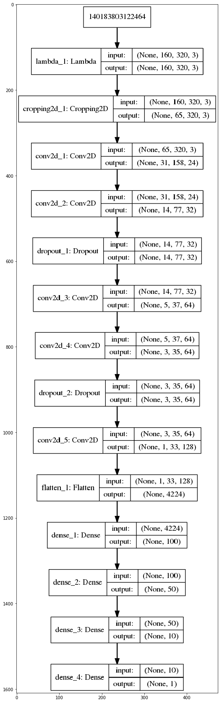

# **Behavioral Cloning** 

## Rubric Points Files Submitted & Code Quality

#### 1. Submission includes all required files and can be used to run the simulator in autonomous mode

My project includes the following files:
* model.py containing the script to create and train the model
* drive.py for driving the car in autonomous mode
* model.h5 containing a trained convolution neural network 
* writeup_report.md or writeup_report.pdf summarizing the results

#### 2. Submission includes functional code
Using the Udacity provided simulator and my drive.py file, the car can be driven autonomously around the track by executing
python drive.py model.h5

#### 3. Submission code is usable and readable

The model.py file contains the code for training and saving the convolution neural network. The file shows the pipeline I used for training and validating the model, and it contains comments to explain how the code works.

Report Overview
---
I decided to go with NVIDA model as suggested with in the course. The model part is straight forward. The trick part is really generating good training and validation data. Recording the data in an intelligent way, using the supplied test data and curating and annotating the data is key to success. In addition to the test data set which was provided by udacity, I recorded for track 1 a full track in the reverse direction. For track 2 I recorded two rounds.

Here I will consider the rubric points individually and describe how I addressed each point in my implementation

[//]: # (Image References)

[image3]: ./imagesexamples/NVIDIA.png "NVIDIA Model"
[image4]: ./imagesexamples/center1.jpg  "Visualization"
[image5]: ./imagesexamples/center2.jpg  "Visualization"
[image6]: ./imagesexamples/reverse.jpg  "Visualization"
[image7]: ./imagesexamples/shadow.png  "Visualization"
[image8]: ./imagesexamples/brightness.png  "Visualization"
[image9]: ./imagesexamples/flipped.png  "Visualization"
[image10]: ./cnn.png  "Model KerasCNN"

## Show Result Videos :

[Video Track1](track1_video.mp4)

[Video Track2](track2_video.mp4) 

## My data

1. Track1 data
images: 7882
measurements: 7882
augmented_images: 15764
augmented_measurements: 15764

2. Track2 data

## Model Architecture and Training Strategy

#### 1. An appropriate model architecture has been employed

My model consists of a convolution neural network with 3x3 filter sizes and depths between 32 and 128 (clonemodel.py lines 66-78) 

The model includes RELU layers to introduce nonlinearity (code line 66), and the data is normalized in the model using a Keras lambda layer (code line 63). 

The model I’ve implemented is the following

#### 2. Attempts to reduce overfitting in the model

The model contains dropout layers in order to reduce overfitting (clonemodel.py lines 70). 

`model.add(Dropout(0.5))`

The model was trained and validated on different data sets to ensure that the model was not overfitting (code line 87 in clonemodel.py). The model was tested by running it through the simulator and ensuring that the vehicle could stay on the track.

`model.fit(X_train, y_train, validation_split=0.2, shuffle=True, nb_epoch=20)`

#### 3. Model parameter tuning

The model used an adam optimizer, so the learning rate was not tuned manually (clonemodel.py line 25).

`model.compile(optimizer='adam', loss='mse')`

#### 4. Appropriate training data

Training data was chosen to keep the vehicle driving on the road. I used a combination of center lane driving, For all the recordings I tried to stay in the middle of the track with a smooth steering.

### Model Architecture and Training Strategy

#### 1. Solution Design Approach

My first step was to use a convolution neural network model similar to the NVIDA model as suggested with in the course, I thought this model might be appropriate because depth 128 model maybe learning more feature.

In order to gauge how well the model was working, I split my image and steering angle data into a training and validation set. I found that my first model had a low mean squared error on the training set but a high mean squared error on the validation set. This implied that the model was overfitting. 

To combat the overfitting,I modified the model and added dropput layers 

At the end of the process, the vehicle is able to drive autonomously around the track without leaving the road.

#### 2. Final Model Architecture

The final model architecture (clonemodel.py lines 66-80) consisted of a convolution neural network which follows the NVIDIA approach
Here is a visualization of the architecture (note: visualizing the architecture is optional according to the project rubric)

![alt text][image3]

#### 3. Creation of the Training Set & Training Process

To capture good driving behavior, I first recorded two laps on track one using center lane driving. Here is an example image of center lane driving:

![alt text][image4]

![alt text][image5]

I then recorded the vehicle driving track 1 in the reverse direction:

![alt text][image6]

To augment the data sat, I also flipped images, added random shadow and increased randomly brightness. This all allowed me to generate more training and validation data out of the existing recorded data. 

Shadow example:
![alt text][image7]

Brigthness example:
![alt text][image8]

Flipped example
![alt text][image9]

I finally randomly shuffled the data set and put 2% of the data into a validation set. 

I used this training data for training the model. The validation set helped determine if the model was over or under fitting. The ideal number of epochs was 30 as evidenced by cnnmodel I used an adam optimizer so that manually training the learning rate wasn't necessary.
